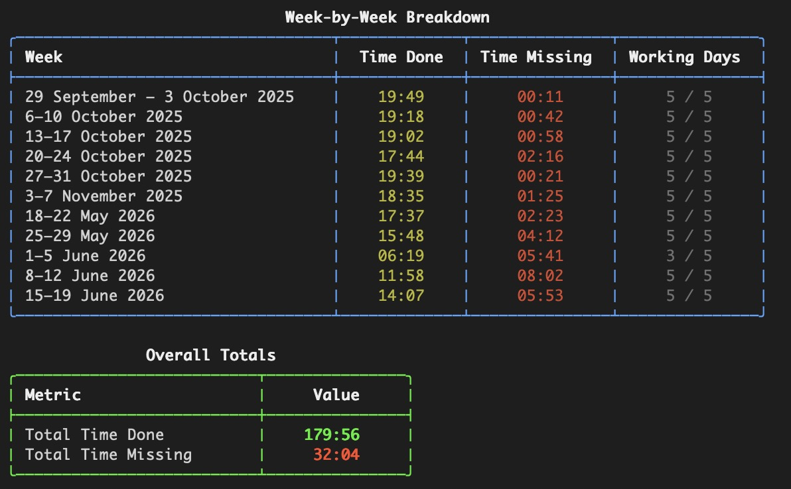
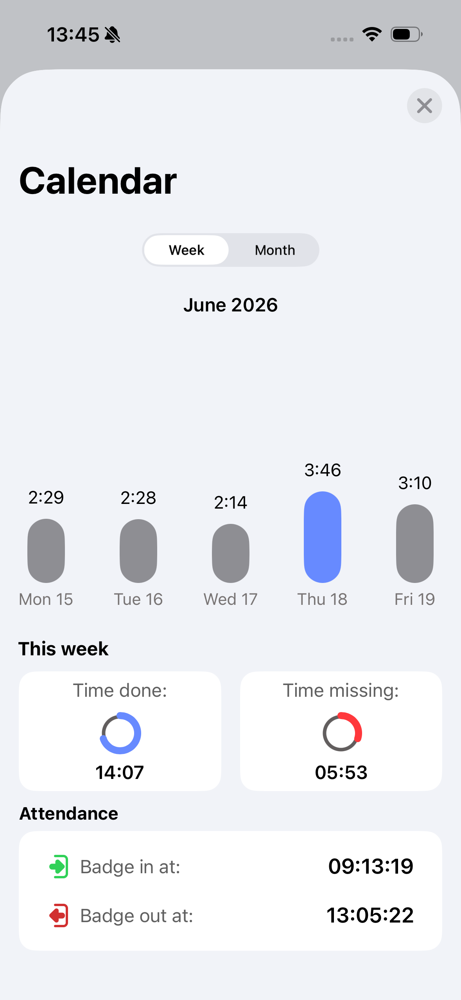
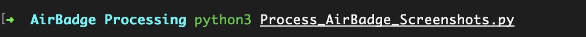
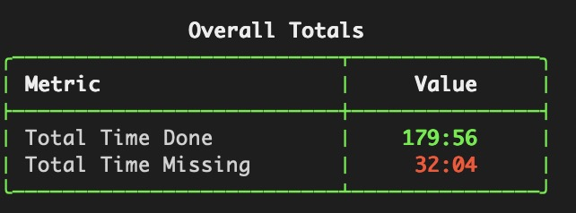
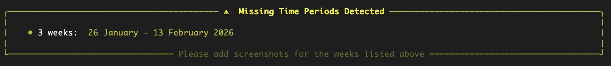

# AirBadge Attendance Processor

A script for **Apple Developer Academy Napoli** students to crunch their AirBadge attendance hours from screenshots — no manual counting required.

Take weekly screenshots from the AirBadge app, point the script at the folder, and get a full breakdown in seconds.



---

## What it does

- Reads every AirBadge weekly screenshot in a folder
- Calculates **time done** and **time missing** for each week
- Automatically recognises **holiday days** (red dates) and adjusts the target accordingly
- Warns you if there are **gaps between your screenshots** so nothing gets missed
- Skips **duplicate screenshots** of the same week automatically

---

## Requirements

- A Mac with **Apple Silicon** (M1 or later)
- **Python 3** — comes pre-installed on macOS, nothing extra needed
- The script installs all its own dependencies the first time it runs

---

## How to use

### 1. Get your screenshots

In the AirBadge app, go to **Calendar → Week view** and screenshot each week you want to track. The script reads the bar chart values — it doesn't matter if you tap on a bar or not.



### 2. Put all screenshots in one folder

Create a folder anywhere on your Mac and drop all your screenshots into it. Any mix of weeks and months is fine — the script sorts everything out automatically.

### 3. Run the script

Open Terminal, then run:

```bash
python3 /path/to/Process_AirBadge_Screenshots.py /path/to/your/folder
```



**Tip:** You can drag the script file and the folder straight from Finder into Terminal — macOS will fill in the path for you automatically.

### 4. Read the output

You'll see a week-by-week table and an overall total.



If any weeks are missing from your folder, a warning panel tells you exactly which ones to add.



---

## Tips

- **More screenshots = more accurate totals.** Try to screenshot every week before the app moves on to the next one.
- Screenshots can be in any order and named anything — the script reads the dates from inside the image.
- You can keep adding new screenshots to the same folder and re-run the script at any time.
- Works on any Apple Silicon Mac (M1, M2, M3, M4, and all variants).

---

## How it works (for the curious)

The script uses Apple's **Vision framework** to read text from your screenshots directly on-device — no internet connection, no accounts, nothing uploaded anywhere. It then checks the colour of each date label to detect holidays, and does all the maths locally.
